# Preliminares

```{r load_pack, include = FALSE}
require(shapes)
require(mvnorm)
require(geomorph)
require(ggplot2)
```

## O que é a GPA? 

A GPA ('Generalized Procrustes Analysis') consiste em realizar uma série de
operações sobre um conjunto de configurações de marcos, de maneira a remover deste
conjunto aquela variação que não é informativa do ponto de vista biológico:

> - Translação;

> - Rotação;

> - Escala.

## Mas... {.build}

Variação em escala é importante do ponto de vista biológico.

A GPA nos permite separar a variação associada à escala daquela
associada à forma, de modo que é possível estimar efeitos alométricos
sobre a variação de forma.

**Alometria**: associação entre um caráter de interesse (morfológico, fisiológico,
ou até mesmo ecológico) e tamanho corporal [@huxley_problems_1932].

<div class='notes'>

escala log-log

</div>

# Passo a Passo

* $k$: número de marcos anatômicos
* $m$: dimensões
* $n$: número de indivíduos

@zelditch_geometric_2004

## Centróide {.flexbox .vcenter .hcenter}

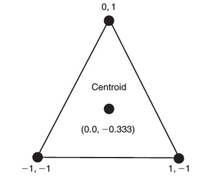

$$C_j = \frac{1}{k}\sum_{i=1}^{k}X_{ij}$$

<div class='notes'>
Média aritmética simples entre os valores em cada marco,
para cada uma das $m$ dimensões.
</div>

----

```{r}
X <- matrix(c(-1, -1, 1, -1, 0, 1), nrow = 3, byrow = T)
X
colMeans(X)
```

## Tamanho do Centróide {.flexbox .vcenter .hcenter}

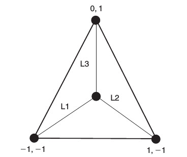

$$CS(X) = \sqrt{\sum_{i=1}^{k}\sum_{j=1}^{m}(X_{ij} - C_j)^2}$$

<div class='notes'>
CS (X) = $\sqrt{L1^2 + L2^2 + L3^2}$
</div>

----

```{r}
centroid.size(X)
```

Assim, o tamanho do centróide é a variável
que representa a variação de escala.

@bookstein_morphometric_1991 demonstrou que o $CS$ é uma variável
"pura" de tamanho.

<div class='notes'>

Isso significa que, dada uma população de configurações desprovida de
relações alométricas, o CS necessariamente irá possuir correlações
nulas com as variáveis de forma. Outras medidas que podem ser
entendidas como tamanho, como por exemplo o comprimento total do
crânio, podem ter correlações com as variáveis de forma, de modo que
esse tipo de medida é na verdade uma combinação entre escala e forma. 

</div>

----

Para remover o efeito do tamanho das coordenadas cartesianas,
podemos simplesmente dividir cada coordenada de cada *landmark*
de uma configuração pelo tamanho do centróide.

```{r}
### <b>
X.norm <- X / centroid.size(X)
### </b>
X.norm
centroid.size(X.norm)
```

## Exemplo Mínimo {.smaller .build}

Vamos seguir os passos referentes à GPA no exemplo mínimo de dois
triângulos. Neste caso, o procedimento é chamado de
"Ordinary Procrustes Analysis".

$$
X = \begin{bmatrix}
	-1 & -1 \\
	1 & -1 \\
	0 & 1 \\
	\end{bmatrix}
\qquad	
W = \begin {bmatrix}
	1.07 & -1.64 \\
	3.10 & -0.72 \\
	1.55 & 0.82 \\
	\end{bmatrix}
$$
	
<div class='centered'>
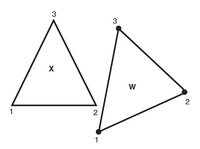
</div>

<div class='notes'>

Caso você precise executar esse procedimento no R, existe uma função
chamada *procOPA* no pacote *shapes*.

</div>

## Translação {.smaller .build}

Esta operação lida com aquela variação proveniente do
posicionamento.

```{r}
X
W <- matrix (c(1.07, -1.64, 3.1, -0.72, 1.55, 0.82),  nrow = 3, byrow = TRUE)
W
```

---

<div class='centered'>

```{r, echo = FALSE, fig.width = 6, fig.height = 6}
plot (rbind (X, W), asp = 1, xlab = 'X', ylab = 'Y', col = 'white', yaxp = c(-2, 1, 3))
points(rbind (X, X[1, ]), type = 'b', pch = 19)
points(rbind (W, W [1, ]), type = 'b', pch = 15)
text (0, -1/3, labels = 'X')
text (colMeans (W), labels = 'W')
```

</div>

---

A operação é relativamente simples: nós apenas subtraímos a posição do
centróide de cada configuração de suas coordenadas, efetivamente
deslocando o centróide de todas as configurações para o par $(0, 0)$.

<div class='centered'>
```{r, fig.width = 4, fig.height = 4, echo = FALSE}
par(mar = c(0, 0, 0, 0))
W.center <- scale(W, center = TRUE, scale = FALSE)
plot (rbind (W, W.center), asp = 1, xlab = '', ylab = '', col = 'white',
      yaxt = 'n', xaxt = 'n', bty = 'n')
points(rbind (W, W[1, ]), type = 'b', pch = 19, col = 'black')
points(rbind (W.center, W.center[1, ]), type = 'b', pch = 19, col = 'lightgrey')
arrows(W [, 1], W [, 2], W.center [, 1], W.center [, 2], lwd = 3, length = 0.15)
text (1.7, -.71, labels = 'W')
text (0, 0, labels = expression(W[c]))
```
</div>

## {.smaller}

A função *scale* dá conta de fazer isso:

```{r}
X.center <- scale(X, center = TRUE, scale = FALSE)
X.center
W.center <- scale(W, center = TRUE, scale = FALSE)
W.center
```

<div class='notes'>

Algumas funções produzem objetos que possuem atributos. Neste caso, a
função *scale* subtrai a posição do centróide original e retorna o
objeto *centralizado*. No entanto, ela retorna também um atributo
deste objeto, que se refere à posição original do centróide.

</div>

---

<div class='centered'>

```{r, echo = FALSE, fig.width = 6, fig.height = 6}
plot (rbind (X.center, W.center),
	asp = 1, xlab = 'X', ylab = 'Y',
	col = 'white', yaxp = c(-2, 1, 3), xaxp = c(-1, 1, 2))
points(rbind (X.center, X.center[1, ]), type = 'b', pch = 19)
points(rbind (W.center, W.center [1, ]), type = 'b', pch = 15)
legend ('topright', pch = c(19, 15),
	legend = c (expression(X[c]), expression(W[c])), bty = 'n')
```

</div>

## Escalonamento {.smaller .build}

Vamos escalonar ambos $X$ e $W$, desta vez guardando o $CS$ de cada configuração.

<div class='columns-2'>

```{r}
cs.X <- centroid.size(X)
cs.X
X.centerscale <- X.center / cs.X
X.centerscale
```

```{r}
cs.W <- centroid.size(W)
cs.W
W.centerscale <- W.center / cs.W
W.centerscale
```

</div>

---

<div class='centered'>

```{r, echo = FALSE, fig.width = 6, fig.height = 6}
plot (rbind (X.centerscale, W.centerscale),
	asp = 1, xlab = 'X', ylab = 'Y', col = 'white', yaxp = c(-0.5, 0.5, 2),
	xaxp = c(-0.5, 0.5, 2))
points(rbind (X.centerscale, X.centerscale[1, ]), type = 'b', pch = 19)
points(rbind (W.centerscale, W.centerscale [1, ]), type = 'b', pch = 15)
legend ('topright', pch = c(19, 15),
	legend = c (expression(X[cs]), expression(W[cs])), bty = 'n')
```

</div>

## Rotação

<div class='columns-2'>

<div class='centered'>
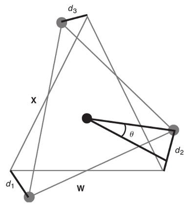
</div>

O que nós queremos é encontrar o ângulo $\theta$ que, ao rotacionar o
triângulo $W$, minimiza a quantidade  
  
$$D = \sqrt{d_1^2 + d_2^2 + d_3^2}$$

</div>

---

```{r, fig.width = 8, fig.height = 6, echo = FALSE}
procDist <- function (theta, A, B)
  {
    R.mat <- array(c(cos (theta), sin (theta), -sin(theta), cos(theta)), c(2, 2))
    B.rot <- B %*% R.mat
    D <- A - B.rot
    d <- rowSums (D^2)
    sqrt (sum (d))
  }
par (mar = c(6, 6, 1, 1))
plot (aaply (seq(0, 2*pi, length.out = 180), 1,
	procDist, A = X.centerscale, B = W.centerscale) ~
	seq(0, 2*pi, length.out = 180), type = 'l', xaxt = 'n', ylab = 'D',
	xlab = expression (theta), cex.lab = 3)
axis(1, at = seq (0, 2*pi, length.out = 5), labels = c (0, 45, 90, 135, 180))
abline (v = 20 * pi / 180, lty = 3, col= 'red')
```

<div class='notes'>

No caso dos triângulos $X$ e $W$, esse ângulo é um pouco menor que 20º.

</div>

---

<div class='centered'>

```{r, fig.width = 6, fig.height = 6, echo = FALSE}
OPA <- procOPA (X.centerscale, W.centerscale)
plot (rbind (OPA $ Ahat, OPA $ Bhat),
	asp = 1, xlab = 'X', ylab = 'Y', col = 'white', yaxp = c(-0.5, 0.5, 2),
	xaxp = c(-0.5, 0.5, 2))
points(rbind (OPA $ Ahat, OPA $ Ahat [1, ]), type = 'b', pch = 19)
points(rbind (OPA $ Bhat, OPA $ Bhat [1, ]), type = 'b', pch = 15)
legend ('topright', pch = c(19, 15),
	legend = c (expression(X[csr]), expression(W[csr])), bty = 'n')
```

</div>

## OPA para GPA

No caso de mais de dois objetos, o procedimento chama-se GPA de fato.

> - Escalonamento e Translação: Idênticos

> - Rotação: Processo Iterativo

<div class='notes'>

1. arbitrariamente escolher uma forma de referência
   (normalmente, selecionando-a dentre os indivíduos disponíveis);
2. sobrepor todos os indivíduos à forma de referência atual;
3. calcular a forma média do conjunto atual de formas sobrepostas;
4. se a Distância de Procrustes entre a forma média e a referência está
   acima de um limite, substituir a forma de referência pela média e
   voltar ao passo 2; senão, terminar.

</div>

## Propriedades do Espaço da Forma {.build}

Em duas dimensões, é necessário estimar, para cada configuração de
marcos, quatro parâmetros:

- Posição do Centróide ($x_C$, $y_C$);

- Tamanho do Centróide ($CS$);

- Ângulo de Rotação ($\theta$).

Em geral, estimamos $m + \frac{m(m-1)}{2} + 1$ parâmetros. Por
exemplo, em três dimensões, sete parâmetros são estimados.

<div class='notes'>

- $m$ pela translação
- $\frac{m(m-1)}{2}$ pela rotação
- um pelo escalonamento

</div>


## Propriedades do Espaço da Forma {.build}

Assim sendo, o procedimento tem duas consequências importantes:

- $m + \frac{m(m-1)}{2} + 1$ graus de liberdade são perdidos;

- A geometria do morfoespaço gerado pelas transformações não é euclidiana
  (por conta da restrição $CS(X_i) = 1$).

Vamos ilustrar estas propriedades em um exemplo onde construímos 10000
triângulos, submetendo estes à GPA.

## Propriedades do Espaço da Forma

<div class='centered'>

```{r, echo = FALSE, fig.width = 5.5, fig.height = 5.5}
par(mar = c(7.1, 4.1, 0.1, 2.1))
plot(t (mil.tri [1, , ]), pch = 20, col = rainbow (10000),
	xlab = 'X', ylab = 'Y', cex = 0.7)
points(x = mil.tri [2:3, , 4034], type = 'b', pch = 20, cex = 2, lwd = 5)
points (mil.tri [1:2, , 4034], type = 'b', pch = 20, cex = 2, lwd = 5)
points (mil.tri [c(1,3), , 4034], type = 'b', pch = 20, cex = 2, lwd = 5)
```

</div>

<div class='notes'>

Lembrar que esta não é uma cobertura total do espaço.

</div>

## Gráfico 3D!!!

Nesse caso, nos valemos do fato que, ao aplicar a GPA sobre estes
objetos, o morfoespaço gerado possui apenas duas dimensões, sendo
possível observamos esse espaço (com a ajuda do *rgl*!).

<div class='notes'>

Para triângulos, três vértices em duas dimensões representam seis
variáveis. Excluíndo-se quatro g.l.s, sobram duas dimensões de
variação de forma. Note que, apesar do espaço possuir apenas duas
dimensões, ele está inserido no espaço ambiente
tridimensional. Essencialmente, ele é uma casca de esfera (por conta
da restrição $CS(X_i) = 1$).

</div>

## Propriedades do Espaço da Forma 

<div class='centered'>

</div>

## Espaço Tangente {.smaller}

<div class='centered'>
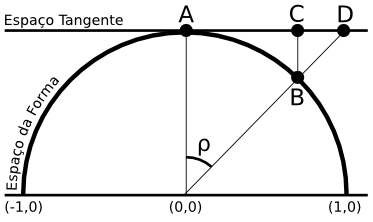
</div>

> - Distância de Procrustes: Distância (em arco) entre duas formas;

> - Por exemplo, a distância entre a forma de referência (média) $A$ e
>   uma forma $B$ qualquer ($\rho$);

> - Diferentes projeções podem ser definidas:
	- Ortogonal ($C$);
	- Estereográfica ($D$).

<div class='notes'>

No caso, $\rho$ pode ser entendido como o tamanho do arco se medido em
radianos sobre uma bola unitária.

</div>

## Espaço Tangente 

<div class='centered'>

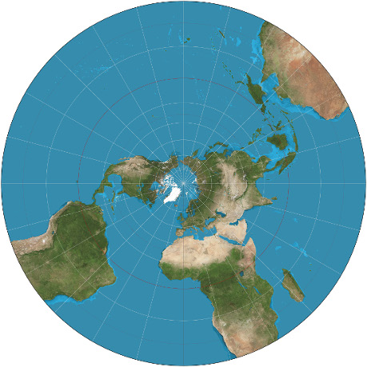

</div>

<div class='notes'>

Note que, a medida que nós nos afastamos do centro, as distorções aumentam.

</div>

## Espaço Tangente

<div class='centered'>

```{r, fig.width = 6.5, fig.height = 4.5, echo = FALSE, fig.cap = 'Projeção Ortogonal'}
par(mar = c(4.1, 4.1, 0.2, 2.1))
plot(tri.pca $ x [, 1:2], col = rainbow(10000), pch = 20, cex = 0.7,
	xlab = '', ylab = '', asp = 1, yaxp = c(-.2, .6, 4))
```

</div>

<div class='notes'>

Nossa expectativa é que a variação morfológica que nós encontramos
fica próxima ao ponto onde o espaço tangente toca a variedade.

</div>

## Espaço Tangente {.build}

Assim, podemos comparar a Distância de Procrustes $\rho$ com a
distância euclidiana calculada no espaço tangente, observando que,
quanto mais distantes estivermos da forma de referência, maiores serão
as diferenças entre as duas distâncias.

<div class='centered'>

</div>

Vamos observar a relação entre $\rho$ e $AC$ no nosso exemplo.

---

<div class='centered'>

```{r, fig.width = 6, fig.height = 6, echo = FALSE}
par (mar = c(7.1, 4.1, 0.1, 2.1))
plot (Norm.tan ~ ProcD, pch = 20, col = rainbow(10000),
	xlab = expression (rho), ylab = 'AC')
abline(a=0, b = 1, lwd = 3)
```

</div>

<div class='notes'>

A medida que nos afastamos do centro, a distância no espaço da
tangente subestima a distância geodésica $\rho$.

</div>

## Consequencias Práticas da GPA

> - TODA inferência estatística é construída sobre a premissa que o
>   espaço que as observações ocupam é euclidiano. Assim, se queremos
>   utilizar técnicas paramétricas de estatística, temos de usar
>   projeções no espaço da tangente.

> - Nossas variáveis de forma (resíduos da tangente) sempre terão uma
>   dimensionalidade menor do que aquela representada pelo número de variáveis.

> - Dessa forma, para lidarmos com variáveis de forma do ponto de
>   vista da inferência estatística, devemos nos valer de técnicas de
>   redução de dimensionalidade (PCA, TPS).

<div class='notes'>

- mas, a princípio, toda variação morfológica que observamos é
  confinada ao entorno da forma média, de maneira que as distorções
  encontradas na periferia provavelmente não interferem na descrição
  de variação de forma.

- em geral, você não precisa se preocupar tanto com a questão de
  projetar no espaço tangente. a função *gpagen* já projeta pra você.

</div>

# Thin Plate Splines

## {.smaller}

<div class='columns-2'>

<div class='centered'>
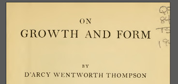
</div>

<div class='centered'>
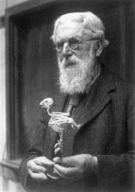
</div>

<div class='centered'>
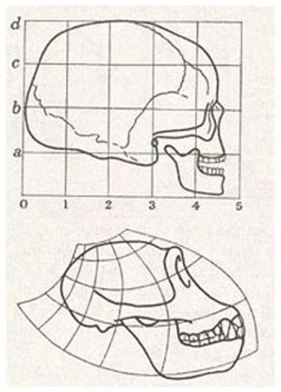
</div>

@thompson_growth_1917 propõe a representação de formas através de grades de
deformação.

</div>

## {.smaller}

<div class='centered'>
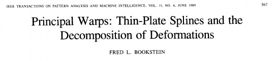
</div>

<div class='columns-2'>

<div class='centered'>
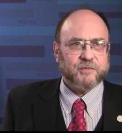
</div>

@bookstein_principal_1989 introduziu o formalismo físico-matemático para a
estimativa de grades de deformação entre uma forma de referência e uma forma-alvo.

Essencialmente, o modelo subjacente ao TPS descreve transformações
entre duas formas atráves de um modelo usado para descrever
dobramentos em uma placa metálica fina, procurando minimizar a
energia necessária para produzir este dobramento.

</div>

---

<div class='centered'>
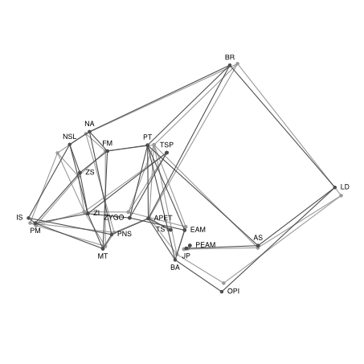
</div>

* Cinza: Referência
* Preto: Alvo

<div class='notes'>

Este procedimento se comporta como uma interpolação, ou seja, procura
descrever como a variação nos tecidos ósseos se comporta no entorno
dos *landmarks* amostrados, recorrendo a um modelo físico para tal.

</div>

---

<div class='centered'>
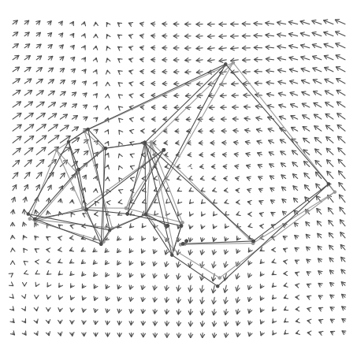
</div>

## Bibliografia {.smaller}

