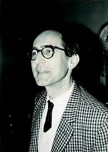

## Morfometria Geométrica

Consiste em representar estruturas morfológicas como configurações de
marcos anatômicos, ao invés de, por exemplo, representar estas
estruturas utilizando distâncias entre estes marcos.

## Antes de 1984

- Certos problemas dos quais a morfometria geométrica depende já
  haviam sido resolvidos do ponto de vista matemático antes de se
  iniciar a 'Revolução'

- Por exemplo, Schönemann (1966) apresentava uma solução
  para o problema de encontrar o(s) ângulo(s) ótimo(s) de rotação
  entre duas configurações de pontos.

##

Kendall definiu grande parte dos conceitos matemáticos em teoria da
forma, de maneira ainda bastante geral e abstrata.

##

Bookstein trabalhou nas bases matemáticas da morfometria geométrica em
seus trabalhos do final da década de 1980 e do início da década de
1990.

##

Rohlf tem muitas contribuições teóricas importantes, mas talvez sua
maior contribuição seja em relação à popularização da morfometria
geométrica devido aos programas da série *tps*.

##

Seu texto introdutório *Geometric Morphometrics for Biologists* ainda
é a melhor introdução ao tema para nós.

